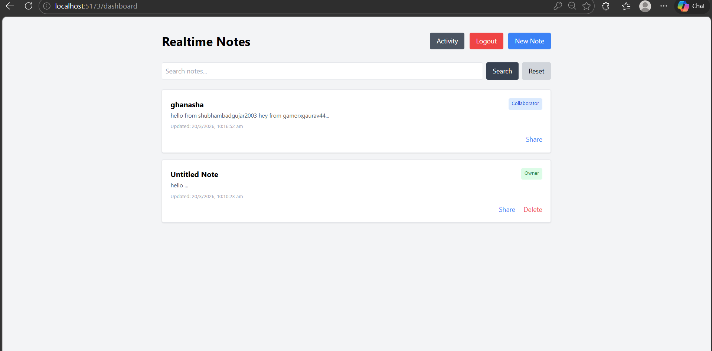

# Real-Time Collaborative Notes Application

## User Interface

## Overview

This project is a full-stack real-time collaborative notes application where multiple users can create, edit and collaborate on notes simultaneously. The system includes authentication, role-based permissions, activity tracking, search functionality and public sharing.

The application demonstrates full-stack development skills including REST APIs, real-time communication and database design.

---

## Tech Stack

### Frontend
React (Vite)  
Tailwind CSS  
Axios  
Socket.io Client  
React Router  

### Backend
Node.js  
Express.js  
Socket.io  
JWT Authentication  
SQLite  

### Deployment
Frontend → Netlify  
Backend → Render 

---

## Features

User Registration

User Login

JWT Authentication

Role Based Access (Owner / Editor / Viewer)

Create Notes

Edit Notes

Delete Notes

Real Time Collaboration

Multiple Users Editing Same Note

Socket Based Live Sync

Basic Conflict Handling

Activity Tracking

Search Notes by Title

Search Notes by Content

Collaborator Management

Protected Routes

---

## Setup Instructions

### Clone Project

git clone YOUR_GITHUB_LINK
cd realtime-notes-app

---

## Backend Setup

cd backend
npm install
npm run dev

Backend runs on:

http://localhost:5000

---

## Frontend Setup

cd frontend
npm install
npm run dev

Frontend runs on:

http://localhost:5173

---

## Environment Variables

### Backend (.env)

JWT_SECRET=secret123
PORT=5000

### Frontend (.env)

VITE_API_URL=http://localhost:5000

---

## API Routes

### Authentication

POST /api/auth/register  
POST /api/auth/login  

### Notes

GET /api/notes  
POST /api/notes  
GET /api/notes/:id  
PUT /api/notes/:id  
DELETE /api/notes/:id  

### Collaboration

POST /api/notes/:id/collaborator  
GET /api/notes/:id/collaborators  

### Search

GET /api/notes/search?q=value  

### Activity

GET /api/notes/activity  

### Public Share

GET /api/notes/public/:shareId  

---

## Database Schema

### Users
id  
name  
email  
password  
role  

### Notes
id  
title  
content  
owner  
share_id  
updated_at  

### Collaborators
id  
note_id  
user_id  
role  

### Activity
id  
user  
action  
note  
created_at  

---

## Architecture Notes

The frontend communicates with backend using REST APIs.

Authentication is handled using JWT tokens.

Real-time collaboration is implemented using Socket.io rooms where each note acts as a collaboration channel.

Access control is enforced at API level by checking ownership and collaborators table.

SQLite is used as lightweight relational database for storing users, notes and activity logs.

---

## How Collaboration Works

Owner creates a note.

Owner adds collaborator using email.

Collaborator logs in and opens the note.

Both users join the same socket room.

Changes appear instantly for all users.

Public link allows read only access.

---
